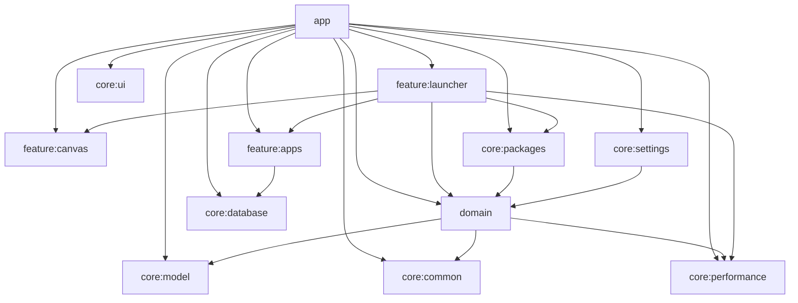

<p align="center">
  
</p>

<h1 align="center">Canvas Launcher</h1>

<p align="center">
  <strong>Infinite 2D home screen launcher for Android.</strong><br/>
  Pan. Zoom. Place apps and tools in a world, not in pages.
</p>

<p align="center">
  <a href="https://github.com/khnychenkoav/CanvasLauncher/actions/workflows/ci.yml"></a>
  <a href="https://github.com/khnychenkoav/CanvasLauncher/stargazers"></a>
  <a href="https://github.com/khnychenkoav/CanvasLauncher/network/members"></a>
  <a href="https://github.com/khnychenkoav/CanvasLauncher/issues"></a>
  <a href="LICENSE"></a>
</p>

<p align="center">
  
  
  
  
  
</p>

## Why Canvas Launcher
Most launchers optimize for fixed pages and static icon grids. Canvas Launcher optimizes for spatial memory and flow:
- no page borders;
- no forced row/column lock;
- no context switch between "home pages".

Apps, notes, frames, and widgets live in one shared coordinate space you can navigate like a map.

## Snapshot (April 5, 2026)
| Metric | Current value |
|---|---|
| Gradle modules | 12 |
| Automated test files | 73 |
| Total test cases (`@Test`) | 661 |
| Unit test cases | 645 |
| Android instrumentation test cases | 16 |
| Aggregate instruction coverage (Jacoco) | **81.72%** |
| Min SDK / Target SDK | 26 / 36 |
| App version | 1.0.0 |
| Canvas widgets | 4 implemented types |

## What Ships Today
### Launcher core
- onboarding flow (`DefaultActivity`) with launcher-role request and fallback path;
- production `HOME` activity (`MainActivity`) with `singleTask` launcher behavior;
- package change receiver (`PACKAGE_ADDED/REMOVED/CHANGED`) with event bus propagation.

### Infinite canvas interaction
- one-finger pan, two-finger zoom, world/screen coordinate transforms;
- minimap projection for spatial orientation at low zoom;
- viewport culling for large datasets;
- edit-mode drag with snap guides and edge auto-pan;
- gesture arbitration to reduce accidental mode conflicts.

### Editing model on the canvas
- brush strokes, sticky notes, text blocks, frames;
- inline editing for text/title entities;
- move/resize/delete for editable objects;
- multi-select with computed selection bounds;
- undo stack for canvas-edit operations.

### Widgets are already in production
Canvas widgets are not a placeholder state. The following types are implemented end-to-end (UI + state + persistence + tests):
- `ClockDigital`
- `ClockAnalog`
- `Weather`
- `Notifications`

Related platform integration is wired:
- notification listener service for live notification feed;
- Android 13+ notifications permission handling;
- coarse/fine location flow for weather context.

### App discovery and management
- direct app launch from canvas;
- searchable app panel with "show on canvas";
- uninstall action from in-app management flow;
- ranked search overlay with quick top-result launch;
- optional web fallback search from launcher input.

### Smart layout strategies
- modes: `SPIRAL`, `RECTANGLE`, `CIRCLE`, `OVAL`, `SMART_AUTO`, `ICON_COLOR`;
- semantic grouping by app intent domain (communication, social, media, games, productivity, finance, etc.);
- vendor clustering for unknown semantic buckets;
- auto-generated labeled frames for semantic and color-based layouts.

### Personalization
- theme modes: system / light / dark;
- 4 light palettes + 4 dark palettes;
- language modes: system, English, Russian, Spanish, German, French, Portuguese (Brazil).

## Engineering Focus: Optimization Work Already Landed
- viewport culling in `core:performance` to avoid over-drawing offscreen app icons;
- cache stack for app icons: in-memory LRU + disk cache + batched preload + in-flight deduplication;
- predictable layout placement with collision-safe fallback search for dense app sets;
- modular dependency graph that keeps feature code isolated and testable;
- release build with shrinking/optimization enabled (`isMinifyEnabled = true` for release).

## Architecture


## Module Guide
| Module | Responsibility |
|---|---|
| `:app` | Activities, launcher role flow, settings screens, receiver wiring, app-level composition |
| `:domain` | Use cases, contracts, layout strategies, orchestration-level business logic |
| `:feature:launcher` | Main launcher presentation, tools overlay, edit orchestration, widget runtime |
| `:feature:canvas` | Infinite canvas rendering, gesture handling, drag and transform logic |
| `:feature:apps` | Apps data sources and repository bindings |
| `:core:database` | Room database, DAO APIs, entities, migrations, schema snapshots |
| `:core:packages` | PackageManager integrations, launch service, icon cache, package event bus |
| `:core:performance` | Camera math, coordinate transforms, viewport culling and minimap helpers |
| `:core:settings` | DataStore-backed preferences and mapping layer |
| `:core:model` | Shared cross-module models for app/canvas/ui state |
| `:core:ui` | Shared Compose theme system and reusable UI primitives |
| `:core:common` | Result/coroutine abstractions and common utilities |

## Quality and Test Coverage
Coverage and test counts below are generated from the repository state after local test execution on April 5, 2026.

### Aggregate quality
- total instruction coverage: **81.72%** (`covered=52267`, `missed=11691`);
- total test cases: **661**;
- local connected smoke run: **16/16 instrumentation tests passed** on device.

### Coverage by module (instruction)
| Module | Coverage |
|---|---|
| `:domain` | 98.20% |
| `:core:performance` | 98.21% |
| `:core:model` | 95.21% |
| `:core:ui` | 95.35% |
| `:core:common` | 96.55% |
| `:feature:apps` | 97.07% |
| `:core:database` | 85.03% |
| `:core:settings` | 80.78% |
| `:feature:launcher` | 80.50% |
| `:app` | 78.83% |
| `:feature:canvas` | 76.69% |
| `:core:packages` | 69.75% |

## CI
GitHub Actions workflow (`.github/workflows/ci.yml`) runs on pushes and pull requests to `main`, using JDK 21 and Android SDK setup, with the project test/build checks.

## Run Locally
### Prerequisites
- Android Studio (recent stable);
- Android SDK 26+;
- JDK 21 recommended.

### Build debug APK
```bash
# macOS / Linux
./gradlew :app:assembleDebug

# Windows PowerShell
.\gradlew :app:assembleDebug
```

### Run core test suite and coverage reports
```bash
# macOS / Linux
./gradlew :domain:test :core:model:test :core:performance:test :core:common:test :core:settings:testDebugUnitTest :core:database:testDebugUnitTest :core:packages:testDebugUnitTest :core:ui:testDebugUnitTest :feature:apps:testDebugUnitTest :feature:canvas:testDebugUnitTest :feature:launcher:testDebugUnitTest :app:testDebugUnitTest

# Windows PowerShell
.\gradlew :domain:test :core:model:test :core:performance:test :core:common:test :core:settings:testDebugUnitTest :core:database:testDebugUnitTest :core:packages:testDebugUnitTest :core:ui:testDebugUnitTest :feature:apps:testDebugUnitTest :feature:canvas:testDebugUnitTest :feature:launcher:testDebugUnitTest :app:testDebugUnitTest
```

### Compute aggregate coverage summary (PowerShell)
```powershell
powershell -ExecutionPolicy Bypass -File .\tmp_cov.ps1
```

## Roadmap
- [x] Infinite canvas launcher base
- [x] Smart semantic layout presets
- [x] Icon-color clustering presets
- [x] Editable canvas objects (brush/notes/text/frames)
- [x] Canvas widgets (clock/weather/notifications)
- [ ] Folders and advanced icon customization
- [ ] Backup/export/import of canvas state
- [ ] Macrobenchmark + startup/jank automation
- [ ] Optional cloud sync

## Contributing
Contributions are welcome.

Start with:
- [Contributing Guide](CONTRIBUTING.md)
- [Code of Conduct](CODE_OF_CONDUCT.md)
- [Security Policy](SECURITY.md)
- [Pull Request Template](.github/pull_request_template.md)

High-impact contribution areas:
- interaction polish for dense-canvas workflows;
- accessibility and localization depth;
- higher coverage in `core:packages` and complex launcher UI branches;
- backup/sync architecture proposals.

## License
Distributed under the MIT License. See [LICENSE](LICENSE) for details.
