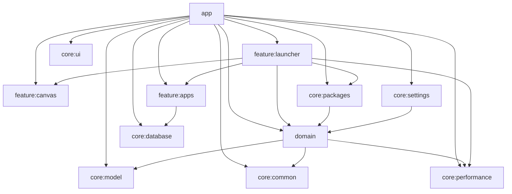

<p align="center">
  
</p>

<h1 align="center">Canvas Launcher</h1>

<p align="center">
  <strong>Infinite 2D home screen launcher for Android.</strong><br/>
  Pan. Zoom. Organize apps as a world, not a grid.
</p>

<p align="center">
  <a href="https://github.com/khnychenkoav/CanvasLauncher/actions/workflows/ci.yml"></a>
  <a href="https://github.com/khnychenkoav/CanvasLauncher/stargazers"></a>
  <a href="https://github.com/khnychenkoav/CanvasLauncher/network/members"></a>
  <a href="https://github.com/khnychenkoav/CanvasLauncher/issues"></a>
  <a href="LICENSE"></a>
</p>

<p align="center">
  
  
  
  
  
</p>

## Why This Project Exists
Most launchers force your phone into fixed pages and rigid icon grids.

Canvas Launcher treats the home screen as a continuous coordinate space:
- no page boundaries;
- no hard grid lock;
- no "next page" mental overhead.

You navigate your apps like a map.

## Current State (What Is Actually Implemented)
The repository already contains a working launcher with a substantial feature set.

### Core launcher flow
- default launcher onboarding flow (`DefaultActivity`) with role request and fallback to system home settings;
- production launcher activity (`MainActivity`) registered as `HOME` (`singleTask`, custom task affinity);
- package add/remove/change receiver with event bus propagation.

### Infinite canvas interaction
- one-finger pan;
- two-finger pinch-to-zoom;
- world/screen coordinate transforms;
- viewport culling for large app sets;
- minimap overlay when zoomed out;
- edge-gesture guard + interaction arbitration to reduce accidental conflicts.

### App management and discovery
- tap icon to launch app;
- long-press drag-and-drop with persisted world coordinates;
- app list panel with search, "show on canvas", and uninstall action;
- smart search overlay with top-match quick launch;
- fallback web search in browser from launcher search input.

### Canvas edit mode
- brush strokes;
- sticky notes;
- text objects;
- frames;
- inline text/title editing;
- object move/resize/delete;
- multi-select with selection bounds;
- snap guides and snap-assist behavior.

### Layout intelligence
- layouts: `SPIRAL`, `RECTANGLE`, `CIRCLE`, `OVAL`, `SMART_AUTO`, `ICON_COLOR`;
- semantic smart grouping (communication, social, media, games, work, finance, etc.);
- dominant icon-color grouping;
- auto-generated labeled frames for `SMART_AUTO` and `ICON_COLOR` group layouts.

### Personalization
- theme mode: system, light, dark;
- 4 light palettes and 4 dark palettes;
- app language: system, English, Russian, Spanish, German, French, Portuguese (Brazil).

### Data layer and persistence
- Room persistence for app positions and canvas edit objects (strokes, notes, text, frames);
- DataStore preferences for layout and theme settings;
- icon caching pipeline (memory + disk cache) with preload/invalidation.

## Feature Matrix
| Area | Status | Details |
|---|---|---|
| Launcher role flow | Implemented | Onboarding + `HOME` role request/fallback |
| Infinite canvas | Implemented | Pan/zoom, transforms, culling, minimap |
| App dragging | Implemented | Persisted world coordinates |
| Search and quick launch | Implemented | Ranked matches + launch top result |
| Apps list management | Implemented | List search, jump to canvas, uninstall |
| Edit mode objects | Implemented | Brush, notes, text, frames |
| Multi-select edit operations | Implemented | Selection, resize, move, delete |
| Smart semantic layout | Implemented | Grouping + auto labeled frames |
| Icon-color layout | Implemented | Dominant-color analysis + auto frames |
| Localization | Implemented | 6 explicit languages + system |
| Widgets | Not implemented yet | Planned area |
| Folders/icon packs | Not implemented yet | Planned area |
| Cloud sync | Not implemented yet | Planned area |

## Project Scale
- 12 Gradle modules;
- 30+ automated tests (`*Test.kt` + smoke coverage);
- modular Clean-style separation (`app` / `domain` / `feature` / `core`).

## Architecture


## Module Guide
| Module | Responsibility |
|---|---|
| `:app` | Activities, launcher/default flow, settings, i18n, receiver wiring |
| `:domain` | Use cases, contracts, layout strategies/grouping |
| `:feature:launcher` | Main launcher UI state, tools overlay, edit orchestration |
| `:feature:canvas` | Canvas rendering, gesture handling, drag interaction |
| `:feature:apps` | Room-backed app store implementation |
| `:core:database` | Room DB, DAO, entities, migrations |
| `:core:packages` | PackageManager sources, app launch service, icon cache, package event bus |
| `:core:performance` | World/screen transforms, culling, minimap projection |
| `:core:settings` | DataStore-backed preferences and mappers |
| `:core:model` | Shared UI/app/canvas domain models |
| `:core:ui` | Shared theme and design primitives |
| `:core:common` | Shared result/coroutines primitives |

## Tech Stack
- Kotlin + Coroutines + Flow;
- Jetpack Compose + Material 3;
- Hilt DI;
- Room;
- DataStore Preferences;
- multi-module Gradle build.

## Quick Start
### Prerequisites
- Android Studio (recent stable);
- Android SDK 26+;
- JDK 21 recommended (project also targets Java 17 for Android modules).

### Build
```bash
# macOS / Linux
./gradlew :app:assembleDebug

# Windows PowerShell
.\gradlew.bat :app:assembleDebug
```

### Run
1. Install debug APK on device/emulator.
2. Open Canvas Launcher.
3. Set it as your default Home app.

## Testing
```bash
# macOS / Linux
./gradlew :domain:test :core:model:test :core:performance:test :core:settings:test :feature:canvas:test :feature:launcher:test :app:testDebugUnitTest

# Windows PowerShell
.\gradlew.bat :domain:test :core:model:test :core:performance:test :core:settings:test :feature:canvas:test :feature:launcher:test :app:testDebugUnitTest
```

CI is configured to run these checks on pushes and pull requests.

## Roadmap
- [x] Infinite canvas launcher base
- [x] Smart semantic layout presets
- [x] Icon-color clustering presets
- [x] Editable canvas objects (brush/notes/text/frames)
- [ ] Widgets on canvas
- [ ] Folders and advanced icon customization
- [ ] Backup/export-import of canvas state
- [ ] Performance benchmark automation and macrobench suite
- [ ] Optional cloud sync

## Contributing
Contributions are welcome and strongly encouraged.

Start here:
- [Contributing Guide](CONTRIBUTING.md)
- [Code of Conduct](CODE_OF_CONDUCT.md)
- [Security Policy](SECURITY.md)
- [Pull Request Template](.github/pull_request_template.md)

Suggested first contribution areas:
- canvas interaction polish and gesture UX;
- accessibility and localization improvements;
- test coverage for edge-case layout/edit scenarios;
- settings UX and discoverability.

## Community Standards
- be respectful and constructive;
- keep changes small and reviewable;
- include tests for non-trivial behavior changes;
- document architectural decisions in PR descriptions.

## License
Distributed under the MIT License. See [LICENSE](LICENSE) for details.
